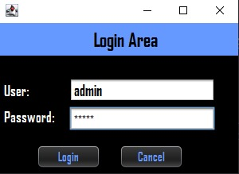
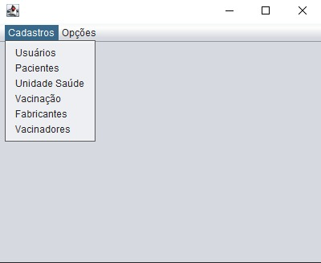
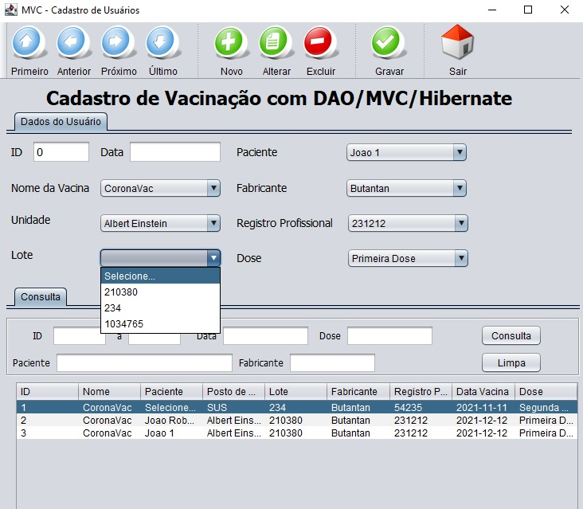

<h1 align="center">
  <span>Java Hibernate</span>
</h1>


<p align="center">
  <a href="#-projeto">Projeto</a>&nbsp;&nbsp;&nbsp;|&nbsp;&nbsp;&nbsp;
  <a href="#-layout">Layout</a>&nbsp;&nbsp;&nbsp;|&nbsp;&nbsp;&nbsp;
  <a href="#-tecnologias-utilizadas">Tecnologias Utilizadas</a>&nbsp;&nbsp;&nbsp;|&nbsp;&nbsp;&nbsp;
  <a href="#-como-executar">Como executar</a>&nbsp;&nbsp;&nbsp;|&nbsp;&nbsp;&nbsp;
  <a href="#-licença">Licença</a>
</p>

<br>

## 💻 Projeto

Esse projeto é desenvolvido em java com um banco de dados relacional MySQL. Tem por objetivo criar uma carteira de vacinação onde o usuário pode incluir, alterar e excluir através das tabelas do usuário, paciente, fabricante, vacinadores, unidade de saúde e a vacinação que faz um SELECT nas demais tabelas, trazendo o resultado para si.

Precisa de um usuário registrado manualmente no banco, para que possa acessa-lo através da pagina de login.

## 🔖 Layout

<p align="center">
  
  
  
</p>

## ✨ Tecnologias utilizadas

Esse projeto foi desenvolvido com as seguintes tecnologias:

- [Java](https://docs.oracle.com/javase/7/docs/api/)
- [Hibernate](https://hibernate.org/orm/documentation/5.6/)
- [MySQL](https://dev.mysql.com/doc/)

## 🚀 Como executar

- Você precisa instalar o [MySQL](https://www.mysql.com/downloads/) e [Hibernate](https://hibernate.org/orm/releases/) para executar este projeto.

**Clone o projeto**

```bash
  git clone https://github.com/kaicLimaOliveira/JavaHibernateMySQL.git
```

**Siga os passo abaixo**

```bash
  #Instale um banco de dados 
  MySQL

  #Instale as dependências
  Hibernate

```


## 📄 Licença

Esse projeto está sob a licença MIT. Veja o arquivo [LICENSE](LICENSE) para mais detalhes.

---

<a href="https://kaicLimaOliveira.github.io">
 
 <br />
 <sub><b>Kaic de Lima Oliveira</b></sub></a>

Feito por Kaic de Lima Oliveira 👋🏽 Entre em contato!

[](https://www.facebook.com/kaic.oliveira.587) [](https://www.instagram.com/kaic.lo)
[](mailto:kaic10@outlook.com)
